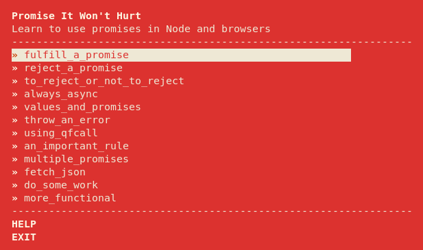

# Promises Workshop

Docker container for running the [promises workshop](https://github.com/stevekane/promise-it-wont-hurt).

## Run

    docker run -it oreng/promises-workshop

## Setup on your laptop

### Prerequisites

* [Docker](https://docs.docker.com/installation)
* [Compose](https://docs.docker.com/compose/install)

### Build Image

    git clone git@github.com:oren/promises-workshop.git
    cd promises-workshop
    docker-compose build

### Run the workshop

    docker-compose run workshop                          # show menu
    docker-compose run workshop run <file.js>            # run your solution
    docker-compose run workshop verify <file.js>         # verify your solution

### Push to Dokcerhub

    docker login
    docker tag promisesworkshop_workshop oreng/promises-workshop:1.0.0
    docker push oreng/promises-workshop:1.0.0
